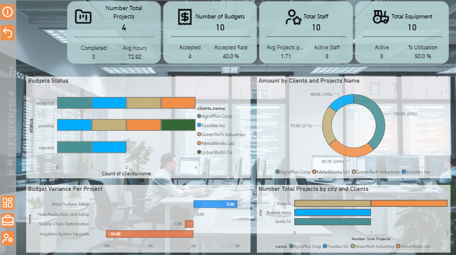
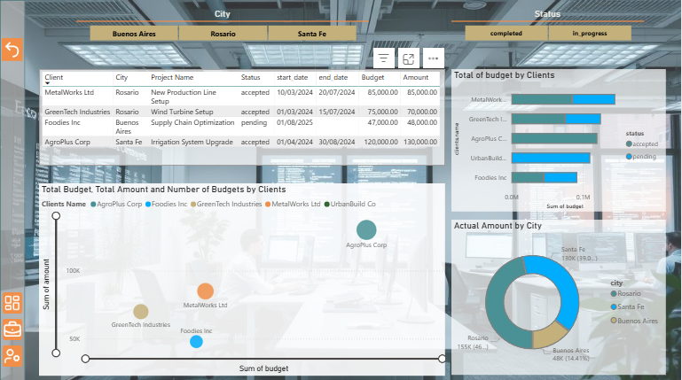
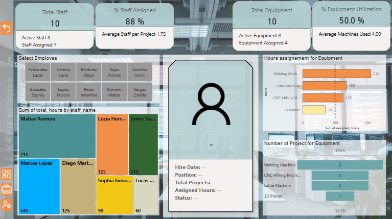
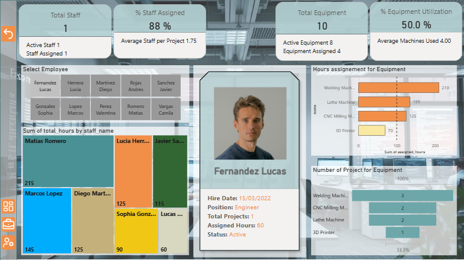

  

# End-to-End-Database-Engineering🏗️

Video overview: 

  

 
1. [Scope 🎯](#1scope)
2. [Functional Requirements 🛠️](#2functional-requirements️)
3. [Database Design and Representation 🧩](#3database-design-and-representation)
4. [Entities and Attributes 🗂️](#4entities-and-attributes️)
5. [Relationships 🔗](#5relationships)
6. [Optimizations and Indexing ⚙️](#6optimizations-and-indexing)
7. [Sample Queries and Use Cases 📊](#7-sample-queries-and-use-cases-)
8. [Integration with Power BI 📈](#8-integration-with-power-bi-)
9. [Key Findings ⭐](#9-key-findings-)
10. [Limitations and Future Improvements ⚠️](#10-limitations-and-future-improvements-️)

##  **1.Scope**🎯

In this section you should answer the following questions:

#### **What is the purpose of your database?**

The purpose of this database is to manage the operations of an engineering consulting firm, including tracking staff members, clients, project budgets, and the assignment of personnel and equipment to each project. It facilitates administrative control, ensures data integrity, and supports further analysis through tools like Power BI.

#### **Which people, places, things, etc. are you including in the scope of your database?**

**PEOPLE:👩‍👩‍👧‍👦** 
- Staff: engineers, project managers, welder, etc.
- Clients: companies or individuals hiring engineering services.
- Contacts: specific people linked to each client.

**PLACES:🕌** 
- Projects: locations, including addresses and cities.

**THINGS:📋**
- Budgets: quotations for proposed work, including status tracking.
- Equipments: physical tools or machines used in projects.
- Assignments: which staff and equipment are involved in each project.

#### **Which people, places, things, etc. are *outside* the scope of your database?**
- Financial transactions: invoices, payments, and accounting.
- Detailed task-level project management: Gantt charts, deadlines.
- Employee payroll, benefits, or HR performance metrics.
- Inventory control of equipment parts or consumables.
- Client satisfaction.
- Attendance or time-tracking (e.g., clock-in/clock-out).

## **2.Functional Requirements**🛠️

In this section you should answer the following questions:

#### **What should a user be able to do with your database?**
- Add, update, or deactivate staff members and clients.
- Create projects and assign budgets.
- Assign staff and equipment to projects with dates and hours.
- Query the database for analysis (e.g., staff workload, project progress, budget status).
- Use with analytical tools like **Power BI**

#### **What's beyond the scope of what a user should be able to do with your database?**
- Automated project scheduling or resource optimization.
- Real-time inventory or procurement management.
- Complex financial accounting unrelated to project budgets.
- Equipment maintenance management.

## **3.Database Design and Representation**🧩

The complete database schema, including table creation scripts, primary and foreign key definitions, can be found in the following file:  
➡️ [SQL Schema](Sql/schema.sql#L1)

  

## **4.Entities and Attributes**🗂️

In this section you should answer the following questions:

#### **Which entities will you choose to represent in your database?**

Staff, Clients, Contacts, Budgets, Projects, Staff_Project, Equipments, Equipments_Project.

#### **What attributes will those entities have?**

Staff: id, first_name, last_name, position, active (boolean for soft deletion).
Clients: id, name.
Contacts: id, name, email, client_id.
Projects: id, name, client_id, contact_id, budget, address, city, start_date, end_date.
Budgets: id, project_id, amount, status.
Equipments: id, name, type.
Staff_project: staff_id, project_id, assigned_hours.
Equipments_project: equipment_id, project_id, assignment_date, unassignment_date, assigned_hours.

#### **Why did you choose the types you did?**
INTEGER for IDs and numeric quantities.
TEXT for names, positions, and status fields.
DATE for project and assignment dates.
BOOLEAN for soft deletion flags.

#### **Why did you choose the constraints you did?**
Primary keys on all IDs.
Foreign keys for relationships (e.g., staff_project references staff and projects).
Not null constraints for mandatory fields (e.g., assigned_hours).
Default values where appropriate (e.g., activo = TRUE).

## **5.Relationships**🔗

A client can have multiple contacts and multiple projects.
Each project has one budget but may have multiple budget revisions (status tracked).
Staff can be assigned to multiple projects and track hours per project.
Equipment can be assigned to multiple projects with specific assignment periods and hours.

## **6.Optimizations, Triggers and Views**⚙️

In this section you should answer the following questions:

#### **Which optimizations (e.g., indexes, views) did you create? Why?**

#### **Indexes**
Created on foreign key columns and frequently queried fields to improve join and filter performance.  
Example: `project_id` in `staff_project` and `client_id` in `projects`.
Access the full project index by clicking this link.
➡️ [Indexes](Sql/schema.sql#L110)

#### **Views**
Developed views like `project_overview` to consolidate information from multiple tables (projects, clients, staff, budgets).
Access the full project views by clicking this link.
➡️ [Views](Sql/schema.sql#L145) 

These are primarily used for reporting and exporting to Power BI.

#### **Triggers**
Implemented automation rules to maintain data integrity.  
Example: a *soft delete trigger* in the `staff` table that sets `activo = FALSE` instead of permanently deleting records.
Together, these optimizations improve database performance, maintain consistency, and simplify analytical workflows.
Access the triggers by clicking this link.
➡️ [Triggers](Sql/schema.sql#L95)

## 7. **Sample Queries and Use Cases** 📊
For a full set of queries, views, and triggers with example outputs, please refer to the project presentation PDF:  

➡️ [Project Presentation](./CS50%20Introduction%20to%20Databases%20with%20SQL.pdf)

## 8. **Integration with Power BI** 📈

After preparing the SQLite3 database, I connected it to Power BI using ODBC and developed three dashboards: an overall overview, a client-focused dashboard, and a dashboard for staff and equipment management.

## 9. **Key Findings** ⭐

1. **Project Status📌**
    - Out of 10 projects, 4 were approved, 4 are pending, and 2 were rejected. Of the 4 approved projects, 3 have been completed and 1 is still in progress.
2. **Budget Performance💰**
    - One project was delivered 5K USD under budget, another project matched its budget exactly, and the remaining two projects exceeded their allocated budgets. The most concerning case is the Irrigation System Upgrade, which shows a budget variance of −10K USD.
3. **Client Activity: 💸**
    - AgroPlus Corp is the client with the highest total project amount, representing 39% (130,000 USD).However, Rosario is the city with the largest budget in question
4. **Staff Workload🧑‍💼**
    - Engineer Matias Romero has been assigned 215 hours, 48% more than the next highest-allocated employee.
5. **Team Allocation🛠️**
    - The Welding Machine has the highest number of hours assigned to active projects (210 hours); it may be worth considering the addition of new equipment. 

## 10. **Limitations and Future Improvements** ⚠️

In this section you should answer the following questions:

#### **What are the limitations of your design?**
#### **What might your database not be able to represent very well?**
 While this database provides a solid foundation for managing an engineering consulting firm, it presents several limitations that should be considered for future development:
- **Financial operations beyond budgets**: The system does not handle payroll, invoices, taxes, or other financial transactions outside of project budgets.
- **Detailed scheduling and resource conflicts:** Staff and equipment assignments are tracked, but the database does not automatically detect overlapping schedules or availability conflicts.
- **Physical tracking of equipment:** Equipment is linked to projects, but real-time location or inventory management is not included.
- **Complex project dependencies:** Relationships between tasks or project phases are not currently represented.
- **Historical changes beyond soft deletion:** While staff records can be deactivated using a soft delete (activo = FALSE), detailed version tracking for projects, budgets, or equipment assignments is not yet implemented.

These limitations should be taken into account when extending the system to include advanced reporting, scheduling, or automated project management features.

